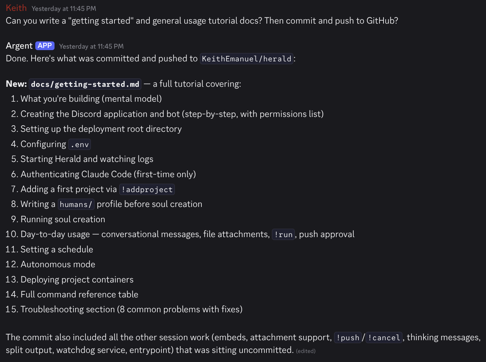

# Herald

Herald is a self-hosted multi-agent orchestration service. Each project gets a Claude Code
agent with its own name, personality, and memory. Herald runs them all from a single server
and bridges everything through Discord.

---

## Why Herald?

I love building things. I have a long list of projects I want to work on — tools I'd actually
use, ideas I've been carrying around for years. What I don't have is the time or consistency
to make real progress on all of them. I start something, life happens, and six weeks later
the project hasn't moved.

Herald is my fix for that. It gives me a partner on every project — an agent that checks in
daily, knows what we were working on, picks things off the backlog when I'm idle, and waits
for my approval before pushing anything. I talk to my agents from Discord, from my phone,
from anywhere. Short replies like "do it" or "start with the third one" work because Herald
includes recent channel history as context.

The accountability system is the part I like most. It tracks when I last engaged with each
project. At 14 days of silence it nudges me. At 21 days it asks if the project is still a
priority. At 28+ days it roasts me.

Herald is not intended to replace coding CLIs or tools. It's made to work alongside them.
To make them easier to access. It can design, build, test, deploy, document, and even create
posts, all from a short discord message. 

Herald isn't just a chatbot. It's an agentic framework for creating a partner that knows 
your project's needs and goals. 
Your Herald agents keep the project going, even when you cannot.



---

## What Herald Does

- **Conversational channels** — message a project's Discord channel; the agent reads it, acts, and replies as itself
- **File attachments** — drop a screenshot, log, or design mockup; the agent reads it
- **Cron schedules** — daily check-ins, weekly blog posts, any task you define per project
- **Push approval** — agents commit locally; you approve pushes via 👍/👎 reaction
- **Deploys** — `!deploy` runs `docker compose up --build -d` for project containers
- **Accountability** — Herald notices when you go dark on a project and says something
- **Per-agent identity** — each agent posts with its own name and avatar
- **Soul creation** — Herald bootstraps a `.herald/SOUL.md` for projects that don't have one
- **Autonomous mode** — agents self-assign roadmap items on a configurable time budget

One agent runs at a time, globally. This prevents rate limit collisions and keeps costs predictable.

---

## Prerequisites

- Podman (recommended) or Docker
- A Discord server and bot token
- A Claude subscription or Anthropic API key

**Why Podman?** Herald needs access to the host container runtime socket to deploy project
containers. With Docker, that socket grants root-equivalent access to the host. Podman rootless
scopes it to a dedicated user. See [Security](#security) below.

---

## Directory Layout

```
HERALD_ROOT/              # e.g. /srv/herald
  compose.yaml            # deployment config (copy from repos/herald/)
  .env                    # secrets — never committed
  projects/               # private YAML configs, managed by Herald
  repos/
    herald/               # Herald source (what agents edit and redeploy)
    myproject/            # your project repos
  deployments/            # docker compose stacks for project containers
```

---

## Quick Start

```bash
# 1. Create the deployment root
mkdir /srv/herald && cd /srv/herald
git clone https://github.com/keithemanuel/herald repos/herald
cp repos/herald/compose.yaml .
cp repos/herald/.env.example .env
mkdir -p projects deployments

# 2. Configure .env (DISCORD_TOKEN, ANTHROPIC_API_KEY, HERALD_ROOT, HERALD_OPERATOR_ID)

# 3. Start Herald
podman compose up -d
podman compose logs -f herald

# 4. Authenticate Claude Code (first time only)
podman compose exec herald claude

# 5. Add a project from Discord
!addproject myproject git@github.com:you/myproject.git AgentName
```

Full instructions: [docs/getting-started.md](docs/getting-started.md)

---

## Discord Commands

| Command | Description |
|---|---|
| `!addproject <name> <repo_url> [agent_name]` | Register a new project end-to-end |
| `!run <project> <task>` | Trigger a one-off agent run |
| `!deploy [project]` | Deploy the project's container |
| `!push [project]` | Check for unpushed agent branches |
| `!cancel [project]` | Cancel the next queued task |
| `!schedule <project> <cron>` | Set or update a project's cron schedule |
| `!autonomy <project> <on\|off\|status>` | Manage autonomous dev mode |
| `!reload` | Hot-reload all project configs |
| `!status` | Queue depth and current job |
| `!projects` | List projects and last-active times |

**Plain messages** in a project channel go directly to the agent with recent history as context.
**File attachments** are downloaded and their paths injected into the task.

---

## Agent Identity

Every Herald-managed project has a `.herald/` directory:

```
project-repo/
  CLAUDE.md          ← stays at root (Claude Code requires it here)
  .herald/
    SOUL.md          ← agent identity — name, role, opinions, history
    MEMORY.md        ← working context across sessions
    humans/
      yourname.md    ← operator profile the agent reads on bootstrap
```

`SOUL.md` lives in the git repo. It gets committed and pushed with operator approval. It
survives container restarts and moves with the project. After a few weeks, your agent has
opinions. It knows the codebase. It knows you.

Write a `.herald/humans/<yourname>.md` profile before the first soul bootstrap — the agent
uses it to pick a name and personality that fits the project and operator.

---

## Security

Herald requires access to the container runtime socket. **Use Podman rootless** — a container
escape gets user-level access rather than root. See [docs/spec.md](docs/spec.md) for the full
threat model.

Claude Code runs as root inside the container. Tool permissions are granted via
`permissions.allow` in Claude Code's settings (seeded at startup), not via
`--dangerously-skip-permissions`.

---

## Docs

- [Getting Started](docs/getting-started.md)
- [Full Spec](docs/spec.md)
- [Agent Pattern](docs/agent-pattern.md)
- [Roadmap](docs/roadmap.md)

---

## License

MIT
